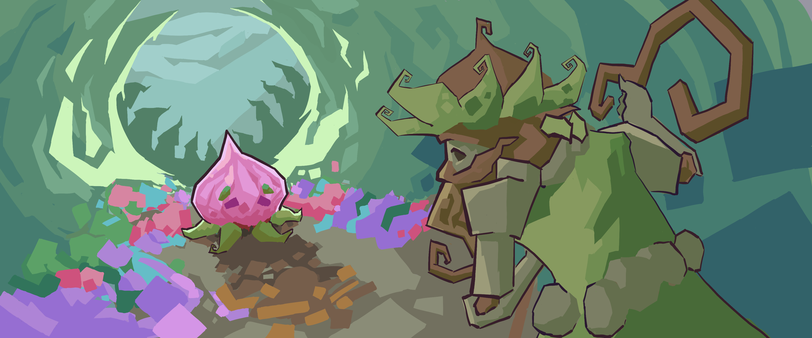

#### CepasCall (Student Project First Semester)
- Twinstick Shooter made at the School4Games with the following people:
- You're also able to download it at: https://s4g.itch.io/cepas-call

#### My Tasks
- Designing the UI, Illustrations, Buttonmapping and implementing most of the UI

#### Group
- Nico Richter - Producer / Vision Keeper / Level Designer

- Katja Seehafer - Lead Game Designer / Level Designer / Sound Designer

- Thomas Krahl - Lead Engineer

- Sarafina Hüsgen - Lead Artist / Animator / 2D Artist

- Brook Tinz - Animator / Concept Artist / Rigging / VFX

- Berkay Gürel - 2D Artist / UI / Engineer

- Enno Winter - 3D Environment Artist / Lighting

- Justin Goldschmidt - 3D Character Artist / 3D General Artist

- Jeremy Froböse - Composer

#### Engine
- Godot

#### Languages
- GDScript